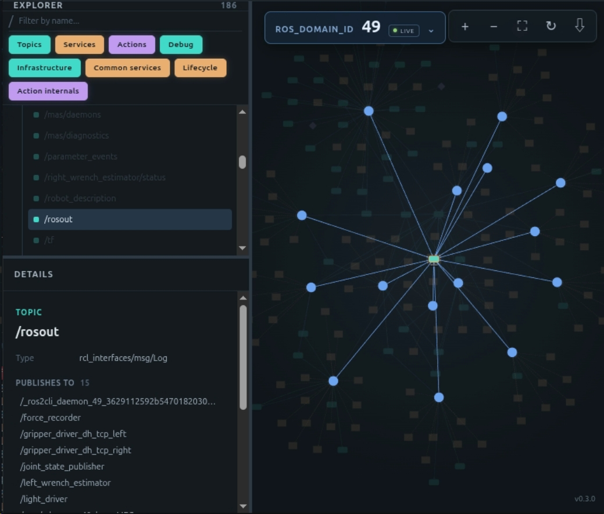

# ros2-node-map

> [繁體中文](README_zh.md)

[](https://github.com/HowardWhile/ros2-node-map/releases/latest)
[](LICENSE)
[](https://github.com/HowardWhile/ros2-node-map/stargazers)

**An interactive ROS 2 node viewer that makes relationships among nodes, topics, services, and actions easier to understand than `rqt_graph`.**


[Watch the demo video](./pic/README/ros2-node-map.mp4) · [Download a release](https://github.com/HowardWhile/ros2-node-map/releases/latest) · [Read the docs](docs/getting-started.md)

## Why ros2-node-map?

Large ROS 2 systems are difficult to inspect when every publisher, subscriber,
service, and action becomes one dense graph. `ros2-node-map` gives the topology
its own interactive workspace:



- Explore **nodes, topics, services, and actions** as separate graph entities.
- Search, filter namespaces and resource kinds, select items, and inspect their relationships.
- Use live discovery on a Linux host with ROS 2 Jazzy, or open a portable graph JSON snapshot without ROS.
- Export the complete snapshot as **JSON**, the current view as **PNG**, or the visible topology as **Mermaid Markdown**.

## Quick start

### Live ROS 2 graph on Linux

On Linux x86-64 or ARM64, install the latest AppImage and start the viewer:

```bash
wget -qO- https://raw.githubusercontent.com/HowardWhile/ros2-node-map/develop/scripts/install-node-map.sh | bash
node-map
```

For live discovery, the host needs ROS 2 Jazzy. If ROS is unavailable, the app
opens in **File-only Mode** instead, so you can still inspect exported snapshots.

### Open a graph snapshot anywhere

Start the app, choose **Open JSON**, or drag a graph JSON file onto the window.
File-only Mode keeps graph exploration, filters, details, and exports available
without ROS discovery. Windows uses this mode by design.

See [Getting started](docs/getting-started.md) for release, offline, backend, and
Windows build details.

## What you can do

| Need | ros2-node-map provides |
| --- | --- |
| Understand data flow | Directed publisher and subscriber relationships through topic nodes |
| Inspect RPC and tasks | Service and action client/server relationships |
| Reduce graph noise | Search plus namespace, kind, system-resource, and action-internal filters |
| Share a topology | Stable graph JSON snapshots and Mermaid Markdown exports |
| Work away from the robot | Open snapshots on hosts without ROS, including Windows |

## Choose a mode

| Mode | When to use it | What runs |
| --- | --- | --- |
| Live mode | Linux with ROS 2 Jazzy | The bundled Python backend discovers and streams the ROS graph |
| File-only Mode | Windows, a Linux host without ROS, or offline review | Only the Electron graph viewer; load graph JSON snapshots |
| Headless / capture | A Linux ROS host without a desktop | Serve the viewer over HTTP or write one graph JSON snapshot |

## Documentation

- [Getting started](docs/getting-started.md) — install, launch, File-only Mode, and snapshot workflow
- [Architecture](docs/architecture.md) — backend/frontend boundary, HTTP API, WebSocket, and runtime capability
- [Development and packaging](docs/development.md) — local setup, backend CLI, tests, and release builds
- [Graph JSON schema](docs/graph-json-schema.md) — stable snapshot contract
- [Testing](docs/testing.md) — automated and manual verification
- [Changelog](CHANGELOG.md) · [Roadmap](docs/roadmap.md)

## Help improve it

If `ros2-node-map` helps you understand a ROS 2 system, [star the project](https://github.com/HowardWhile/ros2-node-map/stargazers)
to make it easier for other ROS developers to find. Bug reports and concrete
workflow feedback are welcome through the [issue tracker](https://github.com/HowardWhile/ros2-node-map/issues).

## License

[MIT](LICENSE)
