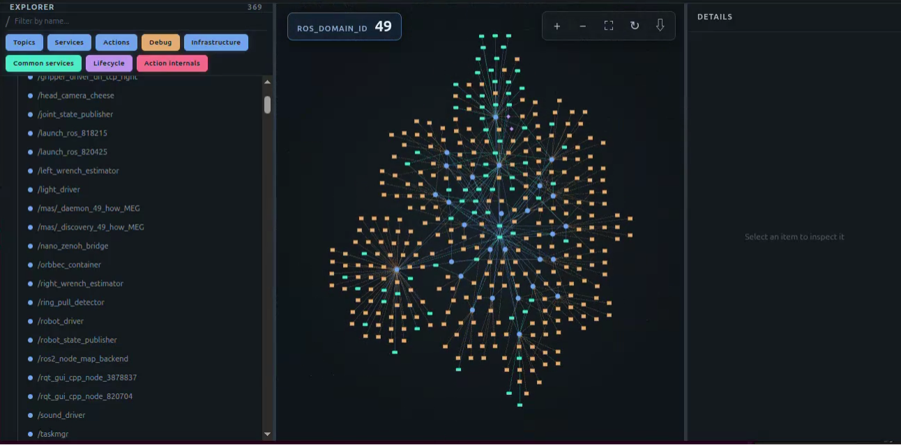

# ros2-node-map

`ros2-node-map` is an advanced `rqt_graph`-style viewer for quickly
understanding the overall topology of a ROS 2 system.



[Watch the demo video](./pic/README/ros2-node-map.mp4)

## Backend development

ROS 2 Jazzy and Python 3.12 are the initial target.

```bash
cd backend
uv sync
uv run pytest
```

`uv sync` creates `backend/.venv` and installs the locked application and
development dependencies. No manual virtual-environment activation is needed.
The ROS discovery dependency (`rclpy`) is supplied by the sourced ROS 2
environment rather than PyPI. Start the live graph backend with:

```bash
source /opt/ros/jazzy/setup.bash
uv run ros2-node-map-backend serve
```

To inspect one snapshot without the UI:

```bash
source /opt/ros/jazzy/setup.bash
uv run ros2-node-map-backend snapshot --pretty
```

## App development

Use a current Node.js LTS release.

```bash
cd app
npm install
npm run dev
```

To open the Electron shell during development:

```bash
npm run electron:dev
```

## Snapshot files and exports

The graph export menu can save the current view as PNG or portable Mermaid
Markdown, and save the complete source snapshot as graph JSON. JSON exports
are unaffected by active display filters; filters are applied again by the app
when that file is reopened.

Open a graph JSON snapshot with the **Open JSON** button or drag one JSON file
anywhere onto the application window. A file is validated against graph schema
version `0.1.0` before it replaces the current graph. When ROS 2 Jazzy or the
bundled backend is unavailable, the Electron app starts in File-only Mode and
keeps these offline viewing and export features enabled.

## Build Linux AppImage

Build the Linux x86-64 AppImage from an Ubuntu 24.04 / Python 3.12 environment.
The build machine needs Node.js LTS, npm, Python 3, and [uv](https://docs.astral.sh/uv/):

```bash
cd app
npm install
npm run dist
```

`npm run dist` builds the Electron renderer, creates a minimal Python runtime
from `backend/uv.lock`, and packages both into one AppImage. Generated runtime
files and release artifacts are not committed to Git.

The packaged executable is written to:

```text
app/release/ros2-node-map-<version>-linux-<architecture>.AppImage
```

For example, an x86-64 build of version `0.2.0` is named
`ros2-node-map-0.2.0-linux-x86_64.AppImage`. The architecture suffix is derived
from the target selected by electron-builder.

The AppImage includes the Electron UI, the Python backend, and the backend's
application dependencies. On startup it automatically loads
`/opt/ros/jazzy/setup.bash` and starts the graph server at
`ws://127.0.0.1:8766`; no separate backend command is required.

Live discovery requires Ubuntu with ROS 2 Jazzy and `rclpy` installed. Without
that runtime the app remains usable in File-only Mode. ROS 2, DDS
implementations, and their native libraries are intentionally not bundled in
the AppImage.

The default packaging compression balances download size with application
startup time. Do not change it to maximum compression unless a smaller download
is more important than launch responsiveness.

If the system does not provide FUSE 2, run the AppImage in extraction mode:

```bash
./app/release/ros2-node-map-*-linux-*.AppImage --appimage-extract-and-run
```

## Versioning

Product versions contain exactly three numeric components, such as `0.2.0`.
Update the frontend, backend, and generated lockfile entries together from the
repository root:

```bash
node scripts/version.mjs set 0.2.0
```

Run `node scripts/version.mjs check` to verify that they remain synchronized.
The graph JSON `schema_version` is an independent compatibility version and is
not changed during a normal product release.

## Documentation

- [Changelog](CHANGELOG.md)
- [Architecture](docs/architecture.md)
- [Graph JSON schema](docs/graph-json-schema.md)
- [Testing](docs/testing.md)
- [Roadmap](docs/roadmap.md)
- [Specification](SPEC.md)
- [Development plan](PLAN.md)

## License

[MIT](LICENSE)

## Knowledge graph

This project uses [Understand-Anything](https://github.com/Egonex-AI/Understand-Anything)
to analyze the codebase and generate a knowledge graph that describes its
structure, component relationships, and guided exploration paths.

The graph can be used in two ways: users can explore it through the interactive
dashboard, while AI agents can inspect the JSON graph directly.

### For AI agents

Include the following instruction in your prompt:

> Read `.ua/knowledge-graph.json`. It is the knowledge graph for this project.

> [!WARNING]
> The source code remains the final source of truth. If the graph was generated
> from an older revision than the current codebase, regenerate it before relying
> on its contents.

### For users

#### Prerequisites

Install [Node.js LTS](https://nodejs.org/) to obtain the `npm` and `npx`
commands. Verify the installation with:

```bash
node --version
npx --version
```

Install the latest Understand-Anything viewer:

```bash
npm install --global https://github.com/Egonex-AI/Understand-Anything/releases/latest/download/understand-anything-viewer.tgz
```

#### Launch the dashboard

From the project root, run:

```bash
understand-anything-viewer .
```
